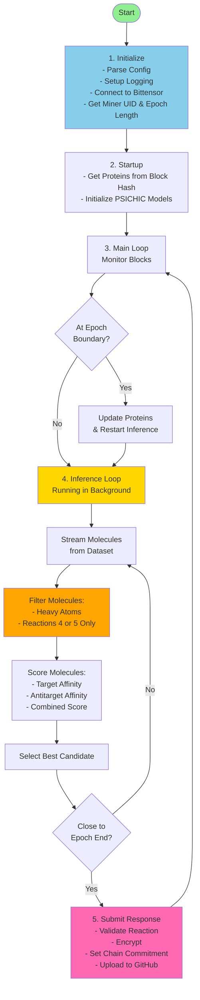

# Miner Workflow Diagram

## High-Level Workflow

## Key Phases

### 1. Initialize
- Parse command-line arguments and configuration
- Setup logging directory
- Connect to Bittensor network
- Get miner UID and epoch length

### 2. Startup
- Get target and antitarget proteins from block hash
- Initialize PSICHIC models for each protein

### 3. Main Loop
- Continuously monitor blockchain blocks
- Detect epoch boundaries
- Update proteins and restart inference when epoch changes

### 4. Inference Loop (Background)
- Stream molecules from HuggingFace dataset
- **Filter**: Keep only molecules with sufficient heavy atoms and using reactions 4 or 5
- **Score**: Calculate binding affinity against target and antitarget proteins
- **Select**: Choose best candidate based on combined score
- **Submit**: When close to epoch end (≤20 blocks), submit the best candidate

### 5. Submit Response
- Validate candidate uses allowed reactions (4 or 5)
- Encrypt response using BDT (Bittensor Drand Timelock)
- Set commitment on blockchain
- Upload encrypted file to GitHub

## Important Notes

- **Reaction Filtering**: Only molecules using reactions 4 or 5 are considered ⭐
- **Epoch-Based**: Proteins change at each epoch boundary
- **Submission Timing**: Only submits when ≤20 blocks from epoch end
- **Continuous Search**: Keeps searching for better candidates until submission time

