# Nova Blueprint Workflow

## High-Level Overview

The Nova Blueprint uses an **evolutionary algorithm** approach to discover molecules, rather than just searching through a pre-existing dataset. It combines:
- **Combinatorial Chemistry**: Generates molecules by combining building blocks from a database
- **Evolutionary Strategy**: Uses elite selection, mutation, and adaptive parameters
- **Score-Guided Sampling**: Learns from top-performing molecules to improve future generations
- **Diversity Maintenance**: Tracks unique molecules to avoid duplicates

## Complete Workflow Diagram

```mermaid
flowchart TD
    Start([Start]) --> LoadConfig[Load Config from input.json<br/>- target_sequences<br/>- antitarget_sequences<br/>- allowed_reaction<br/>- num_molecules<br/>- antitarget_weight]
    
    LoadConfig --> InitModels[Initialize PSICHIC Models<br/>- One model per target sequence<br/>- One model per antitarget sequence]
    
    InitModels --> InitState[Initialize State<br/>- top_pool: DataFrame<br/>- seen_inchikeys: Set<br/>- iteration: 0<br/>- mutation_prob: 0.1<br/>- elite_frac: 0.25]
    
    InitState --> IterationLoop[Iterative Sampling Loop]
    
    IterationLoop --> BuildWeights{Build Component<br/>Weights?}
    BuildWeights -->|Yes| ExtractComponents[Extract Component IDs<br/>from Top Pool Molecules<br/>Format: rxn:X:A:B or rxn:X:A:B:C]
    BuildWeights -->|No| SelectElites
    ExtractComponents --> CalculateWeights[Calculate Component Weights<br/>- Sum scores of molecules<br/>containing each component<br/>- Normalize by count<br/>- Add smoothing]
    CalculateWeights --> SelectElites[Select Diverse Elites<br/>- Top candidates by score<br/>- Ensure diversity in<br/>component space<br/>- Min score ratio: 0.7]
    
    SelectElites --> AdaptiveParams{Adaptive<br/>Parameters?}
    AdaptiveParams -->|Score Improving| IncreaseExploitation[Increase Elite Fraction<br/>Decrease Mutation Prob]
    AdaptiveParams -->|Score Stagnating| IncreaseExploration[Decrease Elite Fraction<br/>Increase Mutation Prob]
    AdaptiveParams -->|First Iteration| KeepDefaults[Keep Default Parameters]
    
    IncreaseExploitation --> RunSampler
    IncreaseExploration --> RunSampler
    KeepDefaults --> RunSampler
    
    RunSampler[Run Sampler<br/>Generate Molecules] --> SamplerDetail[Sampler Details]
    
    SamplerDetail --> GetReactionInfo[Get Reaction Info<br/>from Database<br/>- smarts pattern<br/>- roleA, roleB, roleC]
    GetReactionInfo --> GetMoleculePools[Get Molecule Pools<br/>by Role from Database<br/>- molecules_A<br/>- molecules_B<br/>- molecules_C]
    
    GetMoleculePools --> GenerateBatch{Generate<br/>Batch}
    GenerateBatch --> EliteSampling{Elite Names<br/>Available?}
    
    EliteSampling -->|Yes| EliteOffspring[Generate Elite Offspring<br/>- n_elite = batch_size * elite_frac<br/>- Mutation with probability<br/>- Keep some components from elites]
    EliteSampling -->|No| RandomSampling[Random Sampling<br/>from Pools]
    
    EliteOffspring --> WeightedSampling[Weighted Random Sampling<br/>- Use component weights if available<br/>- Prefer high-scoring components]
    RandomSampling --> WeightedSampling
    
    WeightedSampling --> ValidateBatch[Validate Batch<br/>- Check heavy atoms<br/>- Check rotatable bonds<br/>- Filter duplicates by InChIKey]
    
    ValidateBatch --> CheckEnough{Enough Valid<br/>Molecules?}
    CheckEnough -->|No| GenerateBatch
    CheckEnough -->|Yes| ScoreMolecules[Score Molecules<br/>Parallel Scoring]
    
    ScoreMolecules --> ScoreTargets[Score Against Targets<br/>- Batch size: 512<br/>- Parallel across target models<br/>- Use ThreadPoolExecutor]
    ScoreTargets --> ScoreAntitargets[Score Against Antitargets<br/>- Batch size: 512<br/>- Parallel across antitarget models]
    
    ScoreAntitargets --> CalculateScores[Calculate Final Scores<br/>- avg_target - antitarget_weight * avg_antitarget<br/>- Vectorized with NumPy]
    
    CalculateScores --> UpdateTopPool[Update Top Pool<br/>- Merge with existing pool<br/>- Remove duplicates by InChIKey<br/>- Sort by score<br/>- Keep top num_molecules]
    
    UpdateTopPool --> TrackImprovement[Track Score Improvement<br/>- Calculate improvement rate<br/>- Update adaptive parameters]
    
    TrackImprovement --> CheckWriteTime{Check Write<br/>Time?}
    CheckWriteTime -->|elapsed >= 25min| WriteResults[Write Results to JSON<br/>- Atomic replace via temp file<br/>- Save top molecules]
    CheckWriteTime -->|elapsed >= 20min AND<br/>iteration % 2 == 0| WriteResults
    CheckWriteTime -->|Otherwise| ContinueLoop[Continue Loop]
    
    WriteResults --> LogStats[Log Statistics<br/>- Iteration number<br/>- Average score<br/>- Max score<br/>- Improvement rate<br/>- Elite frac & mutation prob]
    LogStats --> ContinueLoop
    
    ContinueLoop --> CheckTime{Time Limit<br/>Reached?}
    CheckTime -->|No| IterationLoop
    CheckTime -->|Yes| End([End])
    
    style Start fill:#90EE90
    style End fill:#FFB6C1
    style RunSampler fill:#FFD700
    style ScoreMolecules fill:#87CEEB
    style UpdateTopPool fill:#FFA500
    style WriteResults fill:#FF69B4
```



## Key Components

### 1. **Combinatorial Database**
- SQLite database containing:
  - **Reactions**: SMARTS patterns, role definitions (A, B, C)
  - **Molecules**: Building blocks with role masks
- Molecules are generated by combining building blocks: `rxn:{rxn_id}:{A_id}:{B_id}` or `rxn:{rxn_id}:{A_id}:{B_id}:{C_id}`

### 2. **Evolutionary Strategy**

#### **Elite Selection**
- Selects diverse elite molecules from top pool
- Ensures diversity in component space (not just top scores)
- Minimum score ratio: 70% of max score

#### **Component Weighting**
- Learns which building blocks (components) lead to high scores
- Weights components based on scores of molecules containing them
- Used for weighted sampling in future iterations

#### **Adaptive Parameters**
- **Elite Fraction**: Proportion of molecules generated from elites (default: 0.25)
- **Mutation Probability**: Chance to mutate a component (default: 0.1)
- Adapts based on score improvement rate:
  - **Improving**: Increase exploitation (↑ elite_frac, ↓ mutation_prob)
  - **Stagnating**: Increase exploration (↓ elite_frac, ↑ mutation_prob)

### 3. **Sampling Process**

#### **Elite Offspring Generation**
- Takes elite molecules and generates offspring
- With probability `mutation_prob`, replaces a component with random choice
- Otherwise, keeps component from elite parent
- Ensures diversity by avoiding duplicates

#### **Weighted Random Sampling**
- Uses component weights to bias selection toward high-scoring components
- Falls back to uniform random if no weights available

#### **Validation**
- Filters by:
  - Heavy atom count (min_heavy_atoms)
  - Rotatable bonds (min/max)
  - Duplicate InChIKeys (chemical uniqueness)

### 4. **Scoring**

#### **Parallel Scoring**
- Scores molecules in batches of 512 (optimized for RTX 4090)
- Parallel execution across multiple target/antitarget models
- Uses ThreadPoolExecutor for concurrent model inference

#### **Final Score Calculation**
```
final_score = avg_target_affinity - antitarget_weight * avg_antitarget_affinity
```
- Vectorized with NumPy for speed
- Averages across all target models
- Averages across all antitarget models

### 5. **Top Pool Management**
- Maintains a pool of top `num_molecules` candidates
- Deduplicates by InChIKey (chemical uniqueness)
- Sorted by score (descending)
- Updated each iteration with new candidates

### 6. **Result Writing**
- Writes results to JSON file at intervals:
  - **Early writes**: Every 2 iterations after 20 minutes
  - **Final writes**: After 25 minutes
- Uses atomic file replacement (temp file → rename)
- Logs statistics: scores, improvement rate, parameters

## Key Differences from Standard Miner

| Feature | Standard Miner | Nova Blueprint |
|---------|----------------|----------------|
| **Molecule Source** | Pre-existing dataset (HuggingFace) | Generated from combinatorial database |
| **Search Strategy** | Random sampling from dataset | Evolutionary algorithm with learning |
| **Adaptation** | None | Adaptive parameters based on performance |
| **Component Learning** | None | Learns which building blocks work best |
| **Diversity** | Basic filtering | Explicit diversity maintenance in component space |
| **Efficiency** | Sequential processing | Parallel scoring, optimized batches |

## Advantages

1. **Exploration vs Exploitation**: Balances exploring new molecules with exploiting known good components
2. **Learning**: Improves over time by learning which components lead to high scores
3. **Diversity**: Maintains diverse solutions, not just top scorers
4. **Efficiency**: Parallel scoring and optimized batch sizes
5. **Adaptability**: Adjusts strategy based on performance

## Workflow Summary

1. **Initialize**: Load config, initialize PSICHIC models, set up state
2. **Iterate**: 
   - Build component weights from top pool
   - Select diverse elites
   - Adapt parameters based on improvement
   - Generate molecules (elite offspring + random)
   - Validate and filter duplicates
   - Score in parallel
   - Update top pool
3. **Write**: Periodically save results
4. **Repeat**: Continue until time limit

This approach is more sophisticated than simple random sampling, as it learns and adapts over time to find better molecules more efficiently.

